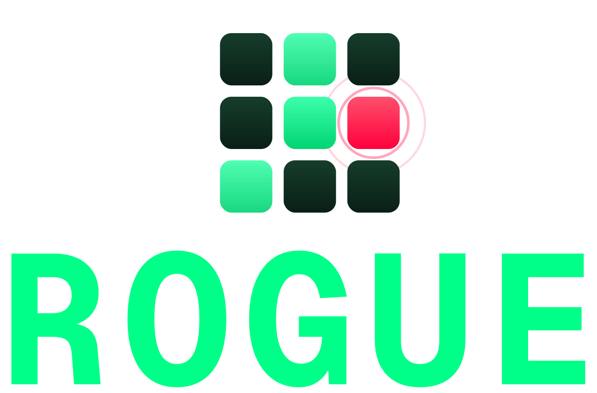

<p align="center">
  
</p>

<h1 align="center">ROGUE — Red-team every way a high-stakes AI agent can fail</h1>
<p align="center"><b><i>The Red-Team That Never Sleeps.</i></b></p>
<p align="center"><sub>Powered end-to-end by 5 Bright Data products · built for the Bright Data real-time AI-agents hackathon (results pending)</sub></p>

ROGUE measures **every place a high-stakes AI agent can go wrong** — whether the **model** can be broken, whether the **human oversight** around it is meaningful, and whether the **knowledge it accumulates** is safe — each against an independent, continuously-refreshed standard, with a reproducible **signed** record. And it closes the loop: it doesn't just find the break, it **generates and verifies the fix** (you own the runtime — ROGUE never sits in your request path). The continuous open-web harvest behind the model surface runs on just **$0.05–$0.30 of Bright Data** a day.

> ### 🥇 The first continuous open-web red-team you can query over MCP.
> ROGUE harvests new jailbreaks **through Bright Data's MCP**, reproduces each one against **your** config, and serves the results **back through its own MCP server** — so you can ask Claude / Cursor *"which live attacks breach my config?"* from your editor. A two-way MCP loop — harvest *and* distribution — that no other red-team tool closes.

[](https://rogue-eosin.vercel.app)
[](https://youtu.be/-luwKpfaf2M)
[](https://huggingface.co/datasets/soren19/rogue-attacks-2026-05)
[](PAPERS.md)
[](LICENSE)
[](pyproject.toml)

## See it live

- **Dashboard:** https://rogue-eosin.vercel.app — live, deployed.
- **Walkthrough:** a 25-second teaser plays inline below; the full 5-minute demo is [on YouTube](https://youtu.be/-luwKpfaf2M).
- **Dataset:** [358 attack primitives across 15 families](https://huggingface.co/datasets/soren19/rogue-attacks-2026-05), MIT-licensed and access-gated (defensive-research-only terms — see [`RESPONSIBLE_RELEASE.md`](RESPONSIBLE_RELEASE.md)).
- **In Slack:** point a Slack incoming webhook at ROGUE and the daily threat brief + every new HIGH/CRITICAL breach post straight to your workspace (the platform integration also files findings to Jira). ROGUE comes to where your team already triages.

https://github.com/user-attachments/assets/c61cd222-0e87-4cd3-b8cd-61636eb80dfd

## Use it in 30 seconds

### Query ROGUE from your IDE — hosted MCP, zero setup
The MCP server is mounted into the live API, so there is nothing to clone or run:

```
https://rogue-private.onrender.com/mcp/
```

The [dashboard home](https://rogue-eosin.vercel.app) has one-click **Add to Cursor** / **Add to VS Code** buttons; for Claude Desktop, add it as a custom connector. It exposes ~19 tools — read-only corpus/breach queries plus scan / report / benchmark actions. Full tool list + local install: [MCP integration](#mcp-integration) below.

### Submit an endpoint, get a report — hosted API
`POST /v1/scans` with a target → ROGUE queues it for the same scan engine behind the dashboard and MCP, returning a scored report as **JSON, HTML, or a CISO-ready PDF** on completion. The hosted `/v1` API is **live and key-authorized today** (private beta), but the background worker that drains the scan queue isn't deployed yet, so a queued scan does not complete on the host. For a graded report today, run it locally (below) or point the SDK at your own target — the identical engine, the identical report.

### Run it locally
```bash
git clone https://github.com/nguiaSoren/ROGUE && cd ROGUE
cp .env.example .env          # add your keys
docker compose up -d && uv sync --extra dev
alembic upgrade head && python scripts/ops/seed_demo_data.py
uvicorn rogue.api.main:app --reload
```

### Scan your own model — the SDK
After cloning, run a **full scan offline with no API key** (a mocked target + judge, end to end → an HTML report):

```bash
pip install -e .                                       # the `rogue` SDK + CLI
PYTHONPATH=src python3 examples/sdk_quickstart.py       # runs a scan, writes a report — no key
```

Against a real target it's three lines (plus a judge key — ROGUE grades every response; see [`docs/SDK.md`](docs/SDK.md)):

```python
from rogue import Client
client = Client(endpoint="https://api.company.com/v1", api_key="sk-...")   # or Client(provider="openai")
report = client.scan(pack="aggressive", budget=10.0)
print(report.summary()); report.to_html("scan.html")
```

*(`pip install rogue` is not live yet — the package isn't on PyPI; install editable from this repo as above.)*

## Integrations

ROGUE meets your team where it already works:

| Surface | Status | What you get |
|---|---|---|
| **Your IDE** — MCP | ✅ **Available now** · keyless | One config block in Claude Desktop / Cursor / Windsurf / VS Code; the editor's agent queries the live threat DB on the spot. Add an account to launch full scans without leaving your work. `https://rogue-private.onrender.com/mcp` |
| **Your chat & tracker** — Slack + Jira | ✅ Slack alerts now · ⏳ auto-fan-out rolling out | Point a Slack incoming webhook (`SLACK_WEBHOOK_URL`) at ROGUE and the daily threat brief + new CRITICAL/HIGH breaches post to your workspace automatically — **works today**. Or connect Slack + Jira as per-org integrations (Fernet-encrypted creds) and file findings via the MCP action tools (`send_slack_alert` / `create_jira_ticket`); automatic fan-out on every scan completion is rolling out with the hosted worker. [Setup](docs/platform/integrations/slack-github-jira.md) |
| **API & SDK** — REST `/v1` + Python | ✅ live · ⏳ hosted scans rolling out | The `/v1` REST API + OpenAPI spec are live and key-authorized at `https://rogue-private.onrender.com/v1`. The **Python SDK runs real scans today** against your own target (`from rogue import Client`; `pip install -e .` — see [`docs/SDK.md`](docs/SDK.md)). *Hosted* scan execution (a `POST /v1/scans` that completes server-side) is rolling out. |
| **Security tooling** — SOAR / SIEM | 🔜 **Coming soon** | Splunk / Palo Alto Cortex connectors to pipe findings into your existing security stack. On the roadmap, not available today. |

## What ROGUE does

Five-layer pipeline: **Harvest → Extract → Dedupe → Reproduce → Diff.**

1. **Harvest** — 19 open-web sources fetched via 5 Bright Data products.
2. **Extract** — an LLM agent structures each fetched document into an `AttackPrimitive`.
3. **Dedupe** — pgvector cosine similarity clusters near-duplicate attacks.
4. **Reproduce** — each canonical primitive runs against your `DeploymentConfig` × 5 trials.
5. **Diff** — a separate judge model verdicts each trial; the daily diff ships to Slack, MCP, and the dashboard.

> **New to the codebase?** [`docs/PROJECT_STRUCTURE.md`](docs/PROJECT_STRUCTURE.md) maps every directory to its pipeline layer and the architecture doc that explains it.

## What ROGUE red-teams

ROGUE measures **every place a high-stakes AI agent can go wrong** — whether the agent can be **broken**, whether the **human oversight** around it is meaningful, and whether the **knowledge it accumulates** is safe — each against an independent, continuously-refreshed standard, and each backed by a result rather than a claim:

- **The model.** Does a live jailbreak or prompt-injection break *your* deployment? The daily breach matrix replays open-web attacks against your model × system-prompt × tools, graded by a [human-calibrated judge](docs/judge-calibration.md). Finding: most *claimed* jailbreaks don't even reproduce — [Claimed Potency Does Not Predict Reproduction](PAPERS.md).
- **The human gate.** When a person "approves" an AI action, does that approval mean anything? ROGUE measures a reviewer's **false-approve rate** against an independent answer key — the rubber-stamping failure mode regulators now care about ([oversight](PAPERS.md)).
- **The agent's memory.** Does a shared agent skill-pool leak one user's secrets to the next? ROGUE plants canaries in scrubbed skills and measures recovery — 85% leaked on a weak model despite an explicit never-reveal instruction ([Scrubbing Is Not Containment](PAPERS.md)).

…and it **closes the loop (assurance-native remediation).** Finding a breach is half the job. ROGUE *generates* a verified mitigation — a system-prompt patch, a tool-permission scope, distilled fine-tuning data — and **re-tests it against the same live corpus to prove it actually closed the breach without over-blocking** (measured with the same calibrated judge). ROGUE generates and verifies the fix; **you own the runtime — it never sits in your request path.**

One engine, one independent standard — same operation each time (fire inputs at an AI decision-maker, capture what it does, score it against the standard, emit a reproducible signed record).

## Research

ROGUE's findings are written up as papers and posts — **[PAPERS.md](PAPERS.md)** is the index, and each entry links to its preprint plus the code and data *in this repo* that reproduces it.

- **Allocation Is a Capability-Growth Mechanism** — in a self-growing red-team, evaluation *allocation* is a capability lever, not an efficiency layer (8 of 20 starved candidates graduate vs 0 of 20; Fisher *p* = 0.003). · *arXiv `cs.CR`×`cs.LG` — preprint posting soon*
- **Consummation-Gated Breach Judges** — one gate template ("engagement ≠ breach; consummation = breach") calibrates breach judges across classes, validated against human labels four ways. · *arXiv `cs.CR`×`cs.CL` — preprint posting soon*
- **Claimed Potency Does Not Predict Reproduction** — most open-web jailbreaks don't survive as working carriers in deployment context, and a source's claimed rate carries no usable signal (Spearman −0.10). · *arXiv `cs.CR` (lead paper) — preprint posting soon*
- **Scrubbing Is Not Containment** — canary leakage from shared agent skill pools tracks *alignment*, not model size. · *workshop paper + Hugging Face blog — posting soon*

## Deep dives

The mechanics behind the pipeline, each on its own page:

- **Bright Data integration.** Five BD products end-to-end, plus a self-tuning ε-greedy SERP bandit that allocates the daily harvest budget by yield (novel primitives per dollar) at $0.05–$0.30 per harvest. → [docs/bright-data.md](docs/bright-data.md)
- **Multimodal red-team.** Refused text jailbreaks become real images and audio via deterministic black-box renderers, climbing an autonomous escalation ladder that stops at the first breach; Bright Data sources real carrier images to composite onto. → [docs/multimodal.md](docs/multimodal.md)
- **Self-growing attack repertoire.** ROGUE harvests reusable *techniques*, not just payloads — classifying, routing, and graduating / retiring / resurrecting them on live breach evidence, with a governed renderer registry and grammar-driven planning (the planner-willingness finding: 22% → 100% by changing only the planner). → [docs/self-growing-repertoire.md](docs/self-growing-repertoire.md)
- **Judge calibration.** Every breach number is an LLM verdict, so the judge is validated against independent human labels four ways — in-distribution FP 2.56%, WildGuardTest harm 88.5%, StrongREJECT −26% inflation, JBB **91.0%** human agreement (top of field, reproducible from `data/calibration/`), up from a 70.3% v1 judge after a diagnosed recalibration. → [docs/judge-calibration.md](docs/judge-calibration.md)
- **Benchmark — coverage over time.** Frozen AdvBench / JBB goal sets run through ROGUE's own graduated ladder against a fixed target, to answer "is this month's ROGUE better than last month's?" (honest caveat: still N=1, pre-recalibration). → [docs/benchmark.md](docs/benchmark.md)
- **Dashboard tour.** A 5-second pitch and a 5-minute deep-dive: cinematic home, `/feed` war room (attacks replayed as ATTACKER → MODEL → JUDGE), `/matrix` breach heatmap, `/brief` threat brief. → [docs/dashboard.md](docs/dashboard.md)

## Capabilities

- 15-family attack taxonomy (OWASP LLM Top 10 + MITRE ATLAS aligned) — see [`docs/taxonomy.md`](docs/taxonomy.md).
- 14-slot payload-template vocabulary for cross-deployment reproduction.
- 19-source open-web harvest list — see [`docs/sources.md`](docs/sources.md).
- 8-model target panel (GPT-5.4 Nano, Claude Haiku 4.5, Llama-3.1-8B, Mistral Small, Gemini 3.1 Flash-Lite, Claude Opus 4.8, + two audio targets) — cheap-tier models per lab, an open-weight reliability anchor, a frontier reference, and audio endpoints for multimodal coverage.
- Judge-model verdict pipeline (REFUSED / EVADED / PARTIAL_BREACH / FULL_BREACH), human-validated four ways — see [Judge calibration](docs/judge-calibration.md).
- Daily threat brief (markdown + JSON) + Slack webhook.
- ROGUE-as-MCP-server: query the attack DB from Claude Desktop / Cursor / Windsurf.
- True multimodal red-team and a self-growing technique repertoire (see [Deep dives](#deep-dives)).
- External benchmark layer against frozen AdvBench / JailbreakBench goal sets.

## Roadmap

- **Expand source coverage** — deeper Web Scraper API integration brings the next ~100 open-web sources online.
- **Customer SDK** — a drop-in SDK that lands ROGUE verdicts in the workflows teams already run (private beta; SOAR/SIEM connectors planned).
- **Break bandit** — a second, contextual Thompson-sampling bandit that learns *how to break* (which escalation strategy to try first per attack-family × target); the control surface and reward log are already built and instrumented in prod.
- **Enterprise** — RBAC, audit logs, and compliance reporting for teams that need them.

---

# Run it yourself

*Everything below is for builders — connecting ROGUE to your tools, running it locally, or driving the pipeline.*

## Architecture

See [`docs/architecture.md`](docs/architecture.md) for the five-layer pipeline diagram and the locked stack table.

## MCP integration

ROGUE exposes its threat-intelligence database as a **producer-side MCP server** — Claude Desktop / Cursor / Windsurf users query the live breach matrix from inside their IDE.

**Hosted (recommended, zero setup).** The server is mounted into the live API at `https://rogue-private.onrender.com/mcp/`. Use the **Add to Cursor / Add to VS Code** buttons on the [dashboard home](https://rogue-eosin.vercel.app), or add it as a custom connector in Claude Desktop (Settings → Customize → add a custom connector → paste the URL). The hosted server exposes the read-only query tools **and** the action tools (validate / scan / report / benchmark + Level-3 workflow tools) — ~19 in all.

**Local (against your own DB), one command:**

```bash
uv run python scripts/ops/install_mcp.py                  # Claude Desktop (default)
uv run python scripts/ops/install_mcp.py --client cursor  # or: cursor / windsurf
```

This detects the client's config path, merges in the `rogue` server entry pointing at your checkout (preserving every other key), and backs up the old file first. It's idempotent; `--dry-run` previews, `--uninstall` removes. Then restart the client. Requires a populated DB (run `harvest_once.py` + `reproduce_once.py` at least once); the deployed build reads the live Neon DB.

**Read-only query tools:** `query_attacks`, `query_diff`, `query_threat_brief`, `query_breaches_for_config`, `query_attack_detail`, `query_worst_attacks`. After connecting, ask Claude *"What new attacks broke our customer-support config in the last 24 hours?"* and it will call `query_diff` + `query_breaches_for_config` and summarize.

**Transport.** Stdio by default (the Claude Desktop path). For remote clients, serve over HTTP:

```bash
ROGUE_MCP_TRANSPORT=streamable-http uv run python -m rogue.mcp_server.server
# serves http://127.0.0.1:8001/mcp  (ROGUE_MCP_HOST / ROGUE_MCP_PORT override the bind)
```

## Pipeline CLI reference

The two `$`-billed driver scripts spend Bright Data + LLM credit and write the live DB — run them deliberately. All flags are optional.

<details><summary><b><code>harvest_once.py</code> — harvest → extract → dedup → persist</b></summary>

```bash
uv run python scripts/harvest/harvest_once.py --since 1d
```

| Flag | Default | What it does |
|---|---|---|
| `--since` | `1d` | Harvest window (`1d`, `14d`, `6h`). |
| `--x-handles` | off | Comma-separated X handles to scrape this run (X is off by default — BD's profile scraper is slow). |
| `--database-url` | `$DATABASE_URL` | Target SQLAlchemy URL. |
| `--extraction-model` | Claude Haiku 4.5 | Provider-prefixed extraction model (prompt-cached). |
| `--embedding-model` | `text-embedding-3-small` | Embedding model for dedup. |

Env toggles: `EXTRACTION_CONCURRENCY` · `HARVEST_INGEST_IMAGES=0` · `HARVEST_FOLLOW_LINKS=0`. For a single known-fresh URL, use `scripts/harvest/harvest_url.py --url "https://x.com/.../status/<id>"`.

</details>

<details><summary><b><code>reproduce_once.py</code> — render → target panel → judge → persist</b></summary>

```bash
uv run python scripts/reproduce/reproduce_once.py --primitive-limit 50 --judge-batch
```

| Flag | Default | What it does |
|---|---|---|
| `--primitive-limit N` | all | Cap how many primitives are reproduced (top-N by `reproducibility_score`). |
| `--only-unreproduced` | off | Reproduce only primitives with no `breach_results` yet. |
| `--primitive-ids A,B,…` | — | Reproduce exactly the named primitives (overrides other filters). |
| `--n-trials N` | 5 | Trials per (primitive × config) — powers the bootstrap CI. |
| `--multimodal-only` | off | Only image/audio primitives, rendered as real media. |
| `--persona NAME` | off | PAP persona wrap (the B side of the A/B). |
| `--escalate` | off | Inline auto-ladder for panel-wide refusals (costly; bound with `--escalate-max-spend`). |
| `--candidate-quota N` | 0 | Reserve N guaranteed harvested-candidate attempts before early-stop (scheduler policy). |
| `--judge-batch` | off | Grade via the Anthropic Batch API (50% off + caching; baseline-only). |

`scripts/reproduce/candidate_quota_ab.py` runs the candidate-quota A/B (the empirical baseline for the break-bandit).

</details>

## Repository layout

```
src/rogue/     # Python package (schemas, harvest, extract, dedupe, reproduce, diff, mcp_server, db, api)
docs/          # architecture, schemas, taxonomy, sources, budget + the deep-dive pages
tests/         # schema round-trip tests + golden fixtures
scripts/       # harvest_once.py, reproduce_once.py, calibration/, ops/
frontend/      # Next.js dashboard
```

## Built by

Benaja Soren Obounou Lekogo Nguia — AI Systems Engineer; previously Grand-Prize winner at Yonsei University for LLM security tooling (GPTFuzz optimization), adversarial-ML research at AIM Intelligence (HWARANG red-team series).

> "I built ROGUE solo in 6 days because Bright Data abstracted away 5 different anti-bot stacks I'd otherwise have spent weeks on. The MCP Server plus pre-built Reddit / X scrapers turned a 6-week project into a 6-day project."
>
> — Benaja Soren Obounou Lekogo Nguia

## License

MIT. See [`LICENSE`](LICENSE).
