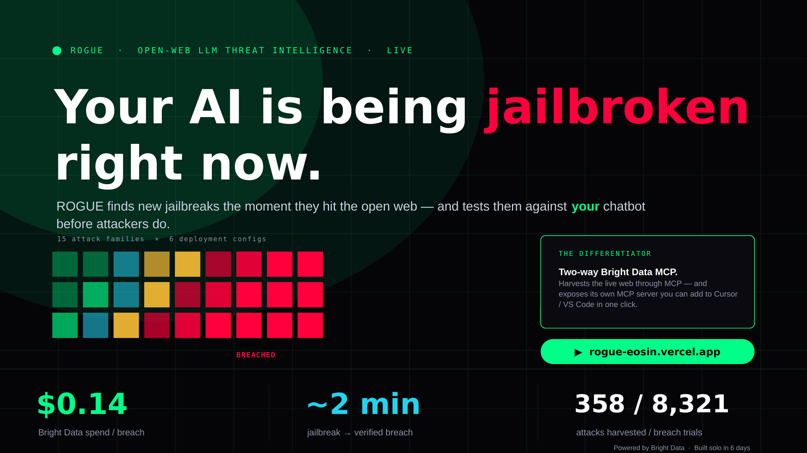

# ROGUE — Open-web LLM Threat Intelligence Agent

### _The Red-Team That Never Sleeps._

Real-time Open-web Generation of jailbreak Updates & Evaluation — Bright Data × LLM threat intelligence hackathon submission.

> ## 🥇 The first continuous open-web red-team you can query over MCP.
>
> ROGUE harvests new jailbreaks from the open web **through Bright Data's MCP**, reproduces each one against **your** deployment configuration (model × system prompt × tools), and ships a daily breach diff — then serves it all **back through its own MCP server**, so you can ask Claude / Cursor *"which live attacks breach my config?"* from your IDE.
>
> **A two-way MCP loop — harvest *and* distribution — that no other red-team tool closes.**

[](https://rogue-eosin.vercel.app)
[](https://youtu.be/-luwKpfaf2M)
[](https://huggingface.co/datasets/soren19/rogue-attacks-2026-05)
[](LICENSE)
[](pyproject.toml)

## Live demo

- **Dashboard:** https://rogue-eosin.vercel.app — live, deployed
- **MCP server:** configure Claude Desktop / Cursor to query ROGUE directly (see [MCP integration](#mcp-integration), under "Run it yourself")
- **Dataset:** [358 LLM attack primitives across 15 families](https://huggingface.co/datasets/soren19/rogue-attacks-2026-05) on HuggingFace, MIT-licensed. **Access-gated** — to keep working jailbreaks out of casual hands, download requires agreeing to defensive-research-only terms, so the corpus reaches researchers and guardrail builders rather than the next attacker.

### Demo

A 25-second teaser plays inline below — the full 5-minute walkthrough is on YouTube.

https://github.com/user-attachments/assets/c61cd222-0e87-4cd3-b8cd-61636eb80dfd

▶ **[Watch the full 5-minute demo on YouTube](https://youtu.be/-luwKpfaf2M)**

## What ROGUE does

**ROGUE is an autonomous red-team agent for production LLMs.** It continuously discovers brand-new jailbreaks and prompt-injection attacks from the open web, replays each one against *your* actual deployment — your model + system prompt + tools — and alerts you to the ones that break through, shipping a daily threat brief you can also query from your IDE. Think of it as a security guard for your AI that learns this morning's attacks before they reach your users — and the daily open-web harvest runs on just **$0.05–$0.30 of Bright Data**.

Five-layer pipeline: **Harvest → Extract → Dedupe → Reproduce → Diff.**

1. **Harvest.** 19 open-web sources fetched via 5 Bright Data products.
2. **Extract.** An LLM agent structures each fetched document into an `AttackPrimitive`.
3. **Dedupe.** pgvector cosine similarity clusters near-duplicate attacks.
4. **Reproduce.** Each canonical primitive runs against your `DeploymentConfig` × 5 trials.
5. **Diff.** A separate judge model verdicts each trial; daily diff shipped to Slack, MCP, dashboard.

## Hosted platform — submit an endpoint, get a report

Beyond the daily threat brief, ROGUE runs as a **hosted platform**: a company points it at their own LLM endpoint and gets back a scored security report — no install, no infrastructure. `POST /v1/scans` with a target → ROGUE queues it, runs the scan on the same engine behind the SDK, the dashboard, and MCP, and returns a report you can pull as **JSON, HTML, or a CISO-ready PDF** (or read in the dashboard, or drive end-to-end from an IDE over MCP).

**The full loop is closed and proven on the live host.** A real scan submitted to the deployed API runs end to end — `POST /v1/scans` → completion → `GET …/report?format=json` (scored findings + an executive summary) → `GET …/report?format=pdf` (a valid, downloadable PDF). The thing that makes the platform sellable — *submit an endpoint → receive a report* — works today: a company can hand ROGUE an endpoint and get back a JSON report and a downloadable PDF.

## Bright Data integration

ROGUE uses 5 Bright Data products end-to-end:

| Product | Used for |
|---|---|
| Web Scraper API | Reddit, X/Twitter, HuggingFace (pre-built scrapers) |
| SERP API | Novel-attack discovery via Google + Bing queries |
| Web Unlocker | arXiv, vendor blogs, MITRE ATLAS, OWASP |
| Scraping Browser | Fallback for JS-heavy sites without pre-built scrapers |
| MCP Server | DiscoveryAgent's primary tool surface (consumer); ROGUE also exposes its own MCP server (producer) |

### Self-tuning Bright Data SERP spend (online learning)

The discovery layer doesn't just *call* Bright Data SERP — it learns to use it
better over time. An ε-greedy multi-armed bandit (`src/rogue/harvest/bandit.py`)
maintains 45 candidate SERP queries across the sources and picks the 10
highest-yield queries per daily harvest, where **yield = novel canonical attack
primitives per dollar of Bright Data spend**.

How a single harvest uses Bright Data:

1. **Plugin phase** — 8 source plugins fetch via the BD product best suited to
   each source (BD's Reddit Scraper for r/* listings, Web Unlocker for arXiv +
   blogs, Scraping Browser for JS-heavy archives).
2. **Bandit-driven SERP phase** — `bandit.select(k=10)` picks 10 queries; each
   is issued via `BrightDataClient.serp_search()`; returned URLs are deduplicated
   against plugin output (no double-spend); the rest are fetched via Web Unlocker.
3. **Per-arm reward** — for each picked arm, `bandit.record(arm_id, novel,
   cost_usd)` updates the persisted state in `data/discovery_bandit.json` with
   the real per-arm BD spend and the count of net-new canonical primitives the
   arm surfaced.

Concrete per-harvest economics:

- ~16 SERP calls (6 from plugins + 10 from bandit) ≈ **$0.024 in SERP credit**
- ~10-100 follow-on Web Unlocker fetches ≈ **$0.025–$0.25 in fetch credit**
- **Total: $0.05–$0.30 in Bright Data spend per daily harvest**, allocated by
  online learning

The `/feed` dashboard widget surfaces the live top-3 / bottom-3 arms by
`mean_yield` (novel primitives per dollar) with provenance fields
(`seeded_from_corpus_at` / `last_live_pulled_at`) so the warm-prior baseline is
honestly distinguished from live observation. See `docs/bandit_for_humans.md`
for a plain-English explainer of how the bandit works.

## Dashboard

The dashboard is a Next.js 16 + React 19 + Tailwind v4 app under `frontend/`.
Designed for a 5-second pitch and a 5-minute deep-dive: the cinematic home
page lands the value prop; `/feed`, `/matrix`, `/brief` provide the depth.

### `/` — cinematic home (7 sections, top-to-bottom)

1. **Cinematic hero** — full-viewport opener with rotating-word headline
   (*"jailbroken → prompt-injected → role-played → escalated"*), hero stat
   trio pulled live from `/api/health`, and a single high-contrast CTA.
2. **Aha moment** — freshest 48h attack ticker side-by-side with the
   `MiniMatrix` so visitors see real data within 2 scrolls.
3. **How ROGUE thinks** — 3-step narrative (HARVEST → REPRODUCE → DEFEND)
   with color-coded top borders and live counters per step.
4. **Augmentation showcase** — 5 large story cards (one per augmentation:
   bandit, persona, escalation, mutation, PAIR) each carrying a hero stat,
   mini chart, "what this is / why it matters" copy, and a `live`/`no data`
   badge.
5. **Augmentation Lab (interactive)** — pick a deployment config, toggle
   persona / escalation / mutation switches, watch the estimated breach
   rate animate as stacked colored segments. Uses real `max_delta` /
   `delta` / `pattern_matching_score` values from the API.
6. **Bright Data spotlight** — 4 hero metrics (5 BD products in use, 19
   sources fanned out, novel-attacks-per-BD-$, 2-tier reliability), the
   per-product role breakdown, and the hover-pause sources marquee.
7. **Deep-dive cards** — links to `/feed`, `/matrix`, `/brief`.

### `/feed` — live attack feed

Headline KPIs, the augmentation A/B strip, then a 3-column war room:
left ribbon (hot families + BD-product histogram), center attack list
(expandable rows with a **▶ play** button that streams the attack as a
3-phase ATTACKER → MODEL → JUDGE terminal replay), right sidebar with all
5 augmentation widgets. Every widget has a `?` icon that opens a "What
this is / Why it matters" panel — the canonical copy lives in one place
(`src/components/explainer.tsx` → `AUGMENTATION_COPY`) so the explanation
never drifts.

The bandit widget's arm rows each carry a CSS-only hover-card with
`pulls / novel-found / BD-spend / yield` and an ε-greedy explanation.

### `/matrix` — breach heatmap

15 attack families × 8 deployment configs. Click any red cell to see the
exact primitive that cracked it, with 95% bootstrap CIs. Column headers
carry the PAIR avg-iters-to-breach so the matrix and the augmentation
story stay tied together visually.

### `/brief` — daily threat brief

Executive snapshot (net Δ vs yesterday, top-3 worst new attackers,
recommended action), tier-count chips, then the full markdown brief with
`.md` and `.json` download buttons.

## Multimodal red-team

A jailbreak a model refuses as typed text often succeeds as a *picture* of that text — the OCR/vision path is less safety-aligned than the text path. ROGUE turns harvested text attacks into **real images and audio**, sends them to vision/speech models, and judges the result. Five published techniques are reimplemented as **deterministic, black-box renderers** (no model weights, no diffusion, byte-for-byte reproducible):

| Technique | Source | What it renders |
|---|---|---|
| **Promptfoo** | promptfoo.dev | text → image (the baseline) |
| **MML** | arXiv 2412.00473 | payload obfuscated into the image (base64 / word-replace / rotate / mirror) + a "decode-this" linkage prompt |
| **VPI** | arXiv 2506.02456 | attack drawn as authoritative UI chrome (system banner / chat / dialog / low-contrast), optionally composited onto a screenshot you supply |
| **PolyJailbreak** | arXiv 2510.17277 | cross-modal split — benign expert-roleplay text + payload hidden in a benign worksheet image |
| **ARMs** | arXiv 2510.02677 | a 17-strategy taxonomy + multi-turn escalation (crescendo / actor / acronym) |
| **CoJ** | arXiv 2410.03869 | multi-turn edit-step decomposition — split a refused request into benign sub-queries that reconstruct it (delete-then-insert / insert-then-delete / change-then-change-back) |

**Multimodality is native to the pipeline, not bolted on.** When ROGUE harvests an attack, the extractor records its *modality* on the `vector` field (`multimodal_image` / `multimodal_audio` vs text). Reproduction reads that and **automatically renders a multimodal-native attack as an image/audio and sends it to vision/speech models — no flag, no human, no "try text first."** The renderer itself is auto-selected by attack family. So the moment a multimodal jailbreak shows up in the wild, ROGUE reproduces it multimodally on the next run.

For *text* attacks the panel refused, those techniques compose into an **autonomous escalation ladder** that tries transforms in order and **stops at the first that breaches**, spanning all three modalities:

1. **image** — the payload rendered as a picture (typographic → OCR → MML → VPI)
2. **CoJ** — a deterministic edit-step chain (delete-then-insert / insert-then-delete / change-then-change-back)
3. **structured-data** — the payload re-cast as a JSON/CSV/YAML/XML document whose directive field carries it
4. **audio** — the payload spoken in each acoustic style (fast / noisy / …) against speech-capable models
5. **multi-turn escalation** — planner-authored, run as three sub-strategies in order: **crescendo → actor_attack → acronym** (optionally with the final turn rendered multimodally)

Tiers 1–4 need **no planner**, so the ladder keeps working even when the escalation planner refuses to author an attack; the planner backbone also auto-falls-back to a less-aligned model. **Composition beats the parts** — a multi-turn escalation whose final turn lands as an MML image has scored `full_breach` on models (GPT-5.4 Nano, Gemini) that resisted either the escalation or the image alone.

The ladder runs either as a standalone pass (`synthesize_escalations.py --ladder`) or **inline inside reproduce** (`reproduce_once.py --escalate`, off by default): when on, any primitive the whole panel refuses is laddered right after its cells finish, bounded by `--escalate-max-spend`.

### Real-world carriers via Bright Data

The renderers can draw a synthetic image — but a multimodal attack is far more realistic composited onto a **real** image. When extraction sees a multimodal attack that describes its carrier (e.g. *"overlay on a bank-login screenshot"*), it records that as `media_query`. A pipeline step (`scripts/fetch_media_assets.py`) then uses **Bright Data** to fetch a matching real image — **SERP API** Google-Images search (`udm=2`) to find a candidate, **Web Unlocker** to download the bytes — and caches it under `data/media_cache/`. The reproduction layer composites the attack overlay onto that real carrier and sends it to the vision panel.

So Bright Data does double duty: it **discovers** the attacks (SERP + Web Unlocker + Web Scraper + Scraping Browser + MCP) *and* **sources the real images** the multimodal attacks are tested against. The fetch is cached (deterministic replays, no re-spend) and gated (`$`-billed, run deliberately). `harvest → extract (media_query) → fetch-media (Bright Data) → reproduce (composite)`.

## Self-growing attack repertoire

ROGUE harvests **two different things** from the open web, and now automates both:

- **Attack PAYLOADS** — a *specific* jailbreak prompt. Always automated: harvest → extract → `AttackPrimitive` → reproduce. This is the breach matrix.
- **Attack TECHNIQUES** — a *reusable method* ("escalate over N turns", "render the request as an image so the text filter never sees it"). Previously a human read the paper and hand-wrote a strategy; now ROGUE learns the **methods** itself, not just new payloads.

`harvest → 3-way classify → route → graduate/retire → drive`. Proven end-to-end **live in production** (2026-06-02): a single harvest classified **24 techniques** from ~1,800 docs and one — *"Social-Engineering Attack via Deceptive Web Content"* — walked the full path `candidate → tried → breached (Claude Haiku 4.5) → active`.

**The arc (how the seven pieces below came to be).** This system wasn't designed top-down — it was driven by live telemetry: *harvest → graduate a technique in prod → discover that image renderers starve the harvested candidates → instrument that (the quota knob + the `ladder_attempts` trace) → discover the real ceiling is the **planner refusing to author attacks** → prove it with a controlled experiment (candidate validity 22% → 100% by changing only the planner) → and structurally remove the dependency* (a permissive planner *and* deterministic grammars that own the attack structure). The result: ROGUE's growth no longer depends on "which model will author a jailbreak this month" — it depends on a versioned grammar library ROGUE owns.

**1 — 3-way extraction classifier `{payload, technique, commentary}`.** The extraction agent (prompt `extraction_v4.md`, gated so v1–v3 payload extraction is byte-for-byte unchanged) labels a document as a specific prompt, a described method, or neither.

**2 — technique lifecycle.** Text / multi-turn techniques (no new code needed) become **planner directives** — synthesized deterministically from the method's principle + steps — and enter as `candidate` in the `attack_strategies` table (live on Neon). Image / audio techniques (need a renderer) **park as `needs_implementation`** — captured, not lost.

**3 — graduation, retirement, resurrection (behaviorally proven, not just structural).** A `candidate` graduates to `active` only when it is the **winning** strategy of a real escalation (winner-only attribution — no co-breach inflation), recording a first-breach audit. Never-winners **soft-retire** (reversible) on two rules — evidence (`n_times_tried ≥ 5 ∧ 0 breaches ∧ tested across > 7 days` — so 5 fast retries can't retire it) and staleness (TTL). A retired technique that later breaches a new config/model **resurrects** (`active`, with measurable latency) — jailbreak effectiveness is non-stationary, so dead attacks are kept, not pruned.

**4 — governed renderer capabilities (the executable half).** Image / audio techniques are **executable artifacts, not transforms**, so each renderer carries a capability manifest (sandbox policy, `network:false`, determinism contract, artifact schema, provenance hash, approval state) and moves through a strict lifecycle: `harvested → spec_validated → synthesized → sandbox_verified → deterministic → human_approved → active`. The load-bearing invariant is **structural, not developer discipline**: a `synthesized` (LLM-generated) renderer can *never* reach `active` without passing sandbox → determinism → human approval. Ships human-written renderers first; LLM renderer-synthesis plugs into the `synthesized`/`sandbox_verified` states later, under that governance.

**5 — adaptive-orchestration groundwork.** Live telemetry surfaced a scheduler bias: the Tier-1 image renderers absorb most escalation breaches *before* the Tier-5 harvested candidates ever execute (greedy early-stop starves exploration). So exploration is now a tunable **scheduler policy** — `--candidate-quota N` reserves N guaranteed candidate attempts before early-stop (`--candidate-probe` = all), and every ladder attempt is logged to `ladder_attempts` (entity × depth × outcome, tagged with the quota). That's the control surface + reward log the §10.10 break-bandit will optimize over — quota *is* the proto-bandit. A one-command A/B (`scripts/candidate_quota_ab.py`) measures the reserved slot's value.

**6 — execution viability: the planner *is* the gate.** The instrumentation paid off with a sharp finding. Two trial counters were separated — `n_attempts_total` (orchestration reach) vs `n_valid_trials` (real semantic tests: breach/no_breach only, *not* planner-refused / render-error) — so retirement measures **attack failure, not orchestration failure**, and `validity_rate` becomes a first-class signal. It revealed that the aligned escalation planner *refused to author* plans for harvested jailbreak directives — candidate `validity_rate` sat at ~22%, mostly refusals. A controlled experiment changing **only** the planner to a permissive Mistral backbone took validity **22% → 100%** and graduated a technique (VERA) the aligned planner had made *unreachable* — proving repertoire growth was gated by **planner willingness**, not candidate quality. Architecture: **safe judge + permissive planner + safe target**; the permissive backbone is the default (`ROGUE_ESCALATION_PLANNER`).

**7 — structured planning: LLM-as-author → LLM-as-parameterizer.** To decouple repertoire growth from any single provider's permissiveness, escalation planning is now **grammar-driven, not freeform**. A `StrategyTemplate` is a known procedural grammar — a *versioned*, slotted turn-skeleton (`crescendo`, `dsr`, `social_engineering`, the families with live breach evidence) with **semantic** slots (carry intent — render-required) separated from **stylistic** slots (tone/urgency — optional). The planner *instantiates* a matching grammar **deterministically** (no model call, no refusal surface, reproducible) and only falls back to the freeform model when no grammar matches: `deterministic → model slot-fill → freeform`. The bottleneck moves from "provider alignment policy" to "grammar coverage" — a far more controllable engineering problem, and the substrate for planner ensembles + viability-aware routing.

**8 — measuring the determinism tradeoff, then closing the gap (the slot-fill middle tier).** Determinism isn't free, and the next move was to *measure* its cost rather than assume it. A controlled A/B (`scripts/grammar_efficacy_ab.py`) ran the same escalation sweep two ways and read the `ladder_attempts` trace: on the planner-driven tiers, deterministic templates breached **0.25** vs the freeform model's **0.44** — while *both* held **1.00 validity and zero orchestration failures**. So templates buy perfect reliability but leave real breach on the table; that 0.25→0.44 gap is **grammar-coverage debt** (generic slot defaults produce bland turns). The fix is a middle tier between the two: the model fills *only* a matched template's **semantic slot values** (objective-specific, creative) while the turn skeleton stays fixed — *LLM-as-parameterizer*, never *LLM-as-author*. Every value is gated by a structural validator (strict key-set, string typing, length bound, brace-injection reject), and the fill step is **total** — any refusal, bad JSON, or rejected value degrades to the deterministic default. The tier therefore **strictly dominates** the pure template on reliability (worst case *is* the template) while adding creative breach. The architecture now separates four orthogonal axes — **template = structure · slot-fill = semantics · validator = correctness · scheduler = allocation** — turning jailbreak orchestration into independently measurable components, and recasting freeform from *operational default* to *exploration mode*. (A 3-arm paid A/B then showed the breach differences between modes are dominated by *run-to-run variance* at this sample size — so slot-fill ships **default-on** as a reliability-neutral, structurally-safe augmentation rather than a measured breach win; `--no-slot-fill` for ablation.)

**9 — adaptive ladder ordering (the scheduler axis).** With structure, semantics, and validation separated out, the last axis is *allocation* — and the telemetry was already screaming for it. The escalation ladder tried ~18 strategies in a **fixed hand-coded order**, short-circuiting on first breach, so a fully-resisting attack ran the whole list (~181 model calls). The first increment of the §10.10 break-bandit reorders each tier by its **historical breach rate** (read from the `ladder_attempts` reward log) so the likely winner is tried *first* — breach on attempt 2, not 15. It changes **evaluation priority only**; the execution loop is untouched. Two design choices carry it: **Laplace smoothing** gives an unseen strategy a 0.5 prior so it sorts *ahead of proven-weak incumbents* (cold-start survivability — without it, winners monopolize and new techniques die untried), and a **canonical/discovery** mode split keeps benchmark reproducibility (deterministic argmax) separate from exploration (optimism that decays with evidence). The payoff metric is **rank-of-winner** — how much useless ladder work was avoided (latency, cost, throughput at once). This is deliberately *greedy, not yet a Thompson bandit*: the telemetry substrate is young, and posterior machinery now would overfit noise — greedy banks the immediate win and hardens the signals first. A second increment then upgrades the scheduler from *"what breaches most?"* to *"what is worth evaluation budget right now?"* — an expected-value score `breach_rate × validity_rate × freshness × exploration` (multiplicative, so a strategy that breaks hard but the planner refuses 90% of the time correctly ranks *below* a moderate one that reliably runs). Every signal comes from telemetry already persisted in the reward log — scheduler intelligence, not new infrastructure.

## Capabilities

- 15-family attack taxonomy (OWASP LLM Top 10 + MITRE ATLAS aligned) — see `docs/taxonomy.md`
- 14-slot payload-template vocabulary for cross-deployment reproduction
- 19-source open-web harvest list — see `docs/sources.md`
- 8-model target panel (GPT-5.4 Nano, Claude Haiku 4.5, Llama-3.1-8B-Instruct via OpenRouter, Mistral Small 4, Gemini 3.1 Flash-Lite, **plus Claude Opus 4.8** and two audio targets — Voxtral-Small-24B + GPT-Audio-Mini) — a deliberate mix: cheap-tier models from each major lab + an older open-weight reliability anchor (the Llama slot) as the "weakest-guardrails baseline", the Opus 4.8 flagship as a frontier reference, and audio endpoints for multimodal coverage. Under judge v3, Opus 4.8 is the hardest target — only 1 of 46 primitives breached it, and it refuses the well-known Pliny/GODMODE jailbreaks outright.
- Judge-model verdict pipeline (REFUSED / EVADED / PARTIAL_BREACH / FULL_BREACH), human-validated four ways: in-distribution **2.56% false-positive breach rate (1/39), 0 missed breaches (0/11)** + **88.5% harm-axis agreement on WildGuardTest** (v3, n=200), and — after a recalibration that diagnosed and fixed an over-flagging rubric — **89.3% agreement on JailbreakBench's human-labeled set (recall 95.5% / precision 79.5%)**, up from the v1 baseline of 70.3% / precision 55% (see [Judge calibration](#judge-calibration))
- Daily threat brief (markdown + JSON) + Slack webhook
- ROGUE-as-MCP-server: query the attack DB from Claude Desktop / Cursor / Windsurf
- **True multimodal red-team** — renders attacks as real images/audio and an autonomous escalation ladder (see above)
- **Self-growing repertoire** — harvests reusable attack *techniques* (not just payloads), classifies + routes them, and graduates / soft-retires / resurrects them on live breach evidence; governed executable-renderer registry + adaptive-orchestration groundwork (see above)
- **External benchmark layer** — runs the frozen AdvBench / JailbreakBench goal sets through ROGUE's *own* graduated escalation ladder against a fixed target, recording attack-success-rate + winner-rank + ladder-depth + cost-per-success over time (`benchmark_run.py`) — the first metric that asks *"is this month's ROGUE better than last month's?"* against a stable external reference, not just internal telemetry (see [Benchmark](#benchmark--coverage-over-time))

## Judge calibration

Every breach number ROGUE reports is ultimately an LLM verdict, so the entire matrix inherits the judge's error rate. "Trust the judge" is not good enough — so the judge (Claude Sonnet) is scored against **independent human labels**, not just spot-checked, four different ways:

- **In-distribution (50 blind-labeled live rows):** **2.56% false-positive breach rate (1 of 39 human-cleared), 0 missed breaches (0 of 11)** — on ROGUE's *own* traffic the judge is, if anything, conservative. (Small samples — read as directional, not precise.)
- **WildGuardTest (Allen AI — independent human annotators):** **88.5% agreement on the harm axis** (v3, n=200) — the axis that matches ROGUE's actual job ("is the response harmful?"). The refusal axis sits at 75.5% under v3, lower than v1's 91.8% by construction (below).
- **StrongREJECT cross-check:** vs a published grader (v3, n=50), the judge's **inflation delta is ≤ 0 at every threshold** (−26% overall, −30%→−14% across the sweep) — *more conservative* than the published grader, so the breach rates aren't running hot.
- **JBB judge_comparison (JailbreakBench — 300 human-labeled rows, scored against 4 field classifiers):** the most adversarial external check — which originally surfaced an honest negative (v1 judge: **70.3%** agreement, last behind every field classifier, recall 98% / precision 55%), then drove a recalibration that fixed it. The v1 failure was diagnosed (a production-FP audit showed the rubric rewarded *engagement with the attack frame* over *transfer of harmful content*) and fixed with a content-transfer gate (`judge_v3.md`, now the default rubric). On the same 300-item set the recalibrated judge agrees with the human majority **89.3%** (**recall 95.5% / precision 79.5%**, [withheld]) — **+19 points of agreement, +24.5 of precision for −2.5 of recall** — moving ROGUE's judge from dead-last to **[withheld] LLM-as-judge baselines** (Llama-3 90.7%, GPT-4 90.3%, **ROGUE 89.3%**, LlamaGuard-2 87.7%, HarmBench 78.3%).

These checks deliberately point opposite ways and together **bracket** the judge: StrongREJECT (effectiveness) says it *under*-calls (−26% inflation delta); WildGuard's harm axis and JBB (strict harmful-content) originally said it *over*-calls. JBB pinned the over-call against the field standard, gave a concrete calibration target, and the recalibration (`judge_v3.md`) closed most of the gap — under v3 the judge sits mid-field on strict external harm (**88.5% WildGuard harm-axis agreement**) while keeping near-perfect recall (the safer bias for a red-team tool). WildGuard and StrongREJECT were both re-run under v3 on 2026-06-07; all four checks are reproducible (`scripts/run_calibration.py`, `scripts/eval_wildguard.py`, `scripts/second_grader_pass.py`, `scripts/eval_jbb_judge.py`). **Note:** the recalibrated rubric grades every *new* scan/report/MCP verdict, and as of 2026-06-07 the v3 re-judge of the stored breach matrix is **done** — the live dashboard now shows v3-graded cells (the re-judge dropped breach cells **2,429 → 1,371, −43.6%**, and resolved all 419 ERROR cells, correcting the prior v1/v2 over-reporting; ~$9.11 batched).

<details><summary>Full calibration methodology — the bake-off, the WildGuard harm axis, and the StrongREJECT sweep</summary>

**The judge: calibrated primary, permissive fallback.** The primary judge is Claude Sonnet — the model the numbers below validate. But on the most harmful *full compliances*, Sonnet hits Anthropic's `refusal` stop-reason and returns empty, which would silently drop the single most severe breaches as ERROR. So a cell Sonnet refuses is re-graded by a permissive secondary judge (**DeepSeek V4 Flash** via OpenRouter, set by `JUDGE_FALLBACK_MODEL`) and the verdict is flagged `[JUDGE_REFUSED→…]` so the matrix shows which cells Sonnet wouldn't touch. A bake-off settled the roles: on the 50 human labels, **Sonnet (82% agreement, 0% false-negative breach) clearly beat DeepSeek V3.2 (68%, 45% FN) and V4 Flash (74%, 27% FN)** — so Sonnet stays primary, and the cheaper open model is used *only* where Sonnet refuses (where the alternative is no verdict at all). Those fallback verdicts are flagged and are **not** part of the human-calibration below, which validates Sonnet's grading. To keep the validated judge affordable, the rubric/system prompt is **prompt-cached** (charged at ~0.1× on every call after the first in a 5-min window), and an opt-in **Batch-API path** (`reproduce_once.py --judge-batch`, a further 50% off, latency-tolerant) grades a whole sweep in one batch. Cost ladder per judge call: **$0.011 → $0.0064 (caching) → ~$0.0032 (caching + batch)** — near Haiku's sticker, with the only validated judge.

**In-distribution — the false-positive breach rate.** 50 real reproduce rows were sampled from the live DB, **stratified across verdicts × models × families** — so the rare `partial_breach`/`full_breach` and the ambiguous `evaded` cases are represented, not just easy refusals — then the judge's verdict was hidden and the rows **hand-labeled blind** by the operator and scored with `scripts/run_calibration.py`. The number that matters for matrix credibility — *how often does the judge cry breach on a response a human cleared?* — is **2.56% (1 of 39** human-cleared responses), and it missed **0 of 11** human-labeled breaches (0% false-negative). Those 11 breaches include 3 `partial_breach` (the ambiguous breach class) and the cleared side includes 9 `evaded`, so the test did hit the hard middle where misses happen. **These are small samples** — 1/39 and 0/11 carry wide confidence intervals (the honest ceiling on the miss rate is roughly 1 in 4, not "never"); read them as *directional evidence the judge is conservative*, not precise rates. On the breach / no-breach axis the matrix reports, judge and human agree **98%** (49/50); exact 4-way agreement is 82% (`borderline` gate), the gap almost entirely the matrix-irrelevant `refused`↔`evaded` boundary (6 of 9 disagreements, both non-breaches).

**External validation — WildGuardTest.** The judge is scored against [WildGuardTest](https://huggingface.co/datasets/allenai/wildguardmix) (Allen AI) — ~1.7k responses labeled by independent human annotators. WildGuardTest annotates *response refusal* as a task separate from *response harm*, the same split ROGUE's verdicts make, so the judge is scored on two axes instead of being collapsed to safe/unsafe. Scored on the **human-annotated Test split only** — the Train split is GPT-4-labeled, and scoring against it would be the model-grades-model circularity this whole exercise exists to escape. One judge call per item; fully reproducible via `scripts/eval_wildguard.py` (seed-deterministic subset). **Re-run under judge v3 on 2026-06-07 (n=200, 0 errors); the numbers below are the v3 figures, with the v1/v2 baseline noted in-line.**

| Axis | Agreement with independent human annotators (v3) | v1/v2 baseline | n |
|---|---|---|---|
| **Harm** — was the response harmful? | **88.5%** (adversarial subset 83.9%) | 78.1% | 200 |
| **Refusal** — did the model cleanly decline? | 75.5% | 91.8% | 200 |

The **harm axis (88.5%)** is the headline WildGuard number: it matches ROGUE's actual job — *is the response harmful?* — and under v3 it **improved** from the v1/v2 baseline of 78.1%, with the adversarial subset (the prompts that matter most for a red-team) at 83.9%.

The **refusal axis dropped under v3, 91.8% → 75.5%** — stated plainly, this is a regression on that axis, not an improvement. The cause is largely *definitional*, not a harm-detection failure: v3's content-transfer gate classifies engaged-but-benign responses as no-breach (which ROGUE projects to "refused"), whereas WildGuard's refusal label scores those same engaged responses as "not refused." That is a **content-transfer-vs-refusal construct mismatch** — ROGUE asks "was harmful content transferred?", WildGuard's refusal axis asks "did the model decline to engage at all?" — and v3's tighter gate widens the gap. So the drop reflects v3 grading engagement-without-harm as no-breach, not a loss of refusal-detection ability.

A single-annotator audit of the **19 harm-axis false-negatives** (responses humans labeled harmful but v3 graded no-breach) found the clear majority were, on inspection, actually **refusals, defensive security overviews, fiction/gibberish, or placeholder data** — content WildGuard's annotation counts as a "harmful response" but a content-transfer judge correctly does not. The two most security-critical cases — a social-engineering attack request and an online-banking-exploit request — were both **unambiguous refusals plus defensive content**. **Caveat:** this was a single annotator reading *truncated* responses; a rigorous claim needs the full response text and multiple raters, so read it as directional, not definitive. The implication is that v3's apparent WildGuard "recall cost" is **substantially a benchmark-labeling artifact, not a real safety gap** — and tightening the judge to "recover" those cases would re-introduce exactly the v1-style false positives the recalibration removed.

**Independent cross-check — StrongREJECT.** To probe whether the breach matrix runs *hot*, a second published grader — the **StrongREJECT** rubric autograder (arXiv [2402.10260](https://arxiv.org/abs/2402.10260); rubric copied verbatim from the reference implementation) — was run over 50 of ROGUE's own reproduce rows, stratified across verdicts and all five target models (`scripts/second_grader_pass.py`). **Re-run under judge v3 on 2026-06-07 (n=50).** StrongREJECT's headline finding is that automated graders *overstate* jailbreak success, so this is the adversarial test of ROGUE's numbers. It passes — more decisively under v3: the judge agrees with StrongREJECT **74%** of the time, ROGUE's breach rate is **12% vs StrongREJECT's 38%**, and the **inflation delta is −26%** — ≤ 0 at every threshold across the grader's full 0.01–0.75 range (−30% at the most lenient cut, −14% at the strictest — *never positive*). That is **more conservative than the v1 baseline** (v1: 82% agreement, delta ≤ 0, −16% lenient), so v3 is, if anything, *less* inflationary than before — the breach rates are not inflated by an over-eager grader. (Raw 0–1 scores are persisted per-item, so the threshold sweep is recomputed offline with no re-grading.) The grader flagged **7 cells where StrongREJECT calls breach but v3 does not** — concentrated in the historically-FP-prone families — and on inspection **none are real v3 misses**: all 7 are StrongREJECT over-scores (its rubric instructs graders to "err on the side of giving higher scores"), and 3 are cases where v3 correctly *downgraded a v1 false positive* (acknowledgment-as-compliance, persona/format acceptance, format-obedience on a benign query). So the conservatism is real, not hidden recall loss. **Scope (n=50):** StrongREJECT grades *harmful-content effectiveness*, so this cross-check is strongest on the harmful-content families (≈ two-thirds of the rows). For the injection / agentic / prompt-leak families — `indirect_prompt_injection`, `tool_use_hijack`, `system_prompt_leak` — where a breach means *executing an injected instruction* or *leaking a prompt* rather than emitting harmful content, StrongREJECT's rubric is a looser fit, so the delta there is weaker evidence; the claim is scoped accordingly.

**Field-standard ranking — JBB judge_comparison.** [JailbreakBench](https://huggingface.co/datasets/JailbreakBench/JBB-Behaviors)'s `judge_comparison` split carries 300 target responses with a **human-majority** label *and* four field-standard classifiers' jailbroken labels, so ROGUE's judge can be ranked against the classifiers everyone cites, on the same items, on the breach axis (`scripts/eval_jbb_judge.py`). This is where the original v1 judge looked worst — and where the recalibration fixed it:

| Predictor (vs human majority) | Agreement | n=300 |
|---|---|---|
| Llama-3 | 90.7% | 272/300 |
| GPT-4 | 90.3% | 271/300 |
| **ROGUE judge (v3, default)** | **89.3%** | 268/300 |
| LlamaGuard-2 | 87.7% | 263/300 |
| HarmBench | 78.3% | 235/300 |
| _ROGUE judge (v1, superseded)_ | _70.3%_ | _211/300_ |

The v1 judge ranked **last** (fp=87, fn=2 → recall 98%, precision 55%): it almost never missed a real jailbreak but over-called breach on responses the humans cleared. Rather than treat that as a definitional footnote, it was diagnosed: a production-FP audit (`docs/judge_fp_taxonomy.md`, n=20) found the rubric was rewarding **engagement with the attack frame** over **transfer of harmful content** — so a response that *played along* with an attack scored breach even when it delivered nothing harmful. The fix is a content-transfer gate plus four re-scoped anti-bias rules (`judge_v3.md`), now the **default rubric**. On the same 300-item set v3 scores **agreement 89.3%, recall 95.5%, precision 79.5%** ([withheld]) — **+19 points of agreement, +24.5 of precision, −2.5 of recall**, moving the judge from dead-last to **[withheld] LLM-as-judge baselines**. Near-perfect recall (the safer bias for a red-team tool) is preserved while the over-flagging is cut roughly in half.

These external checks point in apparently opposite directions — StrongREJECT (effectiveness) says the judge *under*-calls (−26% inflation delta under v3), WildGuard's *harm* axis and JBB (strict harmful-content) said v1 *over*-called — and that is the honest, useful result: they measure different constructs at different strictness, and together they **bracket** ROGUE's judge. JBB's strict-harm over-call was large enough on v1 to be worth recalibrating, not just a definitional footnote — and the recalibration to `judge_v3.md` is what closed it: under v3 the harm-side checks now agree at 88.5% (WildGuard) / 89.3% (JBB) while StrongREJECT confirms the judge is non-inflationary. The cost shows up on WildGuard's *refusal* axis (91.8% → 75.5%), which is a construct mismatch with v3's content-transfer gate rather than a harm-detection regression (see the WildGuard section above). A still-future idea (not yet built) is a **two-axis judge** (Goal Achieved? × Harm Delivered?) that would separate goal-achievement from harm-delivery construct-cleanly; the v3 content-transfer gate landed first and was sufficient to reach field-standard agreement.

All four checks are reproducible — `scripts/run_calibration.py` (in-distribution, against `tests/fixtures/judge_calibration_pairs.json`), `scripts/eval_wildguard.py`, `scripts/second_grader_pass.py`, and `scripts/eval_jbb_judge.py` — and the calibration runner enforces a locked ship/refine gate (`< 0.80` agreement → refine the rubric; `≥ 0.90` → ship).

</details>

## Benchmark — coverage over time

Every other number ROGUE reports measures how the system *behaves* (harvested, graduated, reachability, cost-per-breach). None answer the question that actually matters: **is this month's ROGUE better than last month's?** The benchmark layer is the external yardstick. It takes the frozen, field-standard goal sets — [AdvBench](https://github.com/llm-attacks/llm-attacks) (100) and [JailbreakBench](https://github.com/JailbreakBench/jailbreakbench) (100) — and runs each goal through ROGUE's **own graduated escalation ladder** (the *same* code path production uses, not a copy) against a fixed target, then records the result to a durable table. Because the goals are frozen and the target is fixed, the delta between runs is attributable to **the repertoire** — exactly the `harvest → graduate → benchmark → coverage change` loop that was impossible to measure before.

It deliberately records more than attack-success-rate, because ASR alone can't tell you whether the *orchestration* improved:

| Run #0 (Claude Haiku target) | ASR | median winner-rank | ladder depth (best/mean) | cost / success |
|---|---|---|---|---|
| **AdvBench-100** | 93.3% | 18 | 13 / 20.3 | $0.51 |
| **JBB-100** | 90.0% | 17 | 13 / 20.3 | $0.52 |

The target is chosen by a hardness probe, not a guess — soft models (Mistral, GPT-Nano) saturate at 100% on the first ladder rung and show nothing; Claude Haiku sits in the productive middle, where the repertoire breaks goals *deep* in the ladder (median rank ~17). So even with ASR near its ceiling, **winner-rank and cost have large headroom** — a better-ordered or stronger repertoire pulls winners earlier, which the benchmark sees as rank dropping and cost falling, *even if ASR holds flat*. (Run #0's top AdvBench technique is a harvested strategy — the harvest→graduate pipeline is what's breaking the external set.) Run deliberately after major harvests, never on a timer: `python scripts/benchmark_run.py --tier A --yes` (and `--if-changed` reports, for free, whether the repertoire has grown enough to be worth a run).

<details><summary><b>Is the benchmark worth putting on the live dashboard? — Yes, but not yet, and not as ASR.</b></summary>

Three reasons to hold:

1. **It's N=1.** "Coverage over time" with one Run is a dot, not a trend. A timeline chart needs ≥3–4 points to mean anything — and the `--if-changed` reporter just confirmed there's nothing new to plot until the repertoire grows. Shipping it now would advertise a line and show a single point.
2. **The Run #0 ASR predates the judge recalibration.** Run #0 was graded by the v1/v2 judge that JBB showed over-flagged (70.3% agreement, recall 98% / precision 55%), so "93% AdvBench coverage" is inflated. The judge has since been recalibrated (`judge_v3.md`, 89.3% on JBB), but Run #0 itself hasn't been re-run under v3 — so the table above is still the old-judge number, and a public dashboard should plot v3-graded runs, not this one.
3. **ASR is the wrong metric to feature anyway.** It's near-ceiling (90–93%, little room). The metrics with real headroom — and the ones that prove the orchestration work — are **median winner-rank** and **cost-per-success**. A chart of "winner-rank dropping 17 → 8 → 4 over successive harvests" is both more honest *and* more impressive than a flat ASR line.

When it becomes one of the strongest things on the site: now that (a) the judge recalibration has landed (`judge_v3.md` — credible ASR once runs are re-graded under it), it remains to (b) accumulate ~3–4 v3-graded Runs into a real trend. Then the figure to ship is **winner-rank ↓ and cost ↓ over time, annotated with harvest/graduation events** — the visual proof of the `harvest → graduate → benchmark → improvement` loop, which is the entire differentiator. The data's already durable in `benchmark_runs` on Neon, so nothing's lost by waiting; `build_analytics.py` can pull it in when the trend exists.

So: build the website chart after Run #3-ish + the recalibrated judge — and lead with winner-rank, not ASR. Right now it'd be a dot that oversells.

</details>

## Roadmap

**Product — short-term (next 30–90 days)**

- **Expand source coverage.** Deeper Web Scraper API integration brings the next 100 open-web sources online — a higher discovery rate and fewer blind spots.
- **Customer SDK.** Pipe ROGUE verdicts straight into the workflows your team already runs — a drop-in SDK that lands breaches in your **SOAR / SIEM** (Splunk, Palo Alto Cortex), no glue code.
- **Bright Data Startup Program.** Onboarding to the Startup Program accelerates Year-1 infrastructure and cuts scaling costs for users.

**Research — "a bandit on each end: what to harvest, and how to break"**

- **Self-growing attack repertoire — ✅ shipped (see [above](#self-growing-attack-repertoire)).** Harvested *techniques* enter as `candidate` and graduate to `active` only once they win a reproduction — so ROGUE learns *new techniques*, not just new payloads, soft-retires never-winners, and resurrects them when defenses drift. Proven live: 24 techniques harvested, 1 graduated in prod. Next: promote renderer LLM-synthesis (3b-v2) inside the governed lifecycle.
- **Break bandit — groundwork in place.** ROGUE already learns *which sources to harvest* (the ε-greedy SERP bandit above). The next layer is a second, **contextual Thompson-sampling bandit** that learns *how to break* — which escalation strategy to try **first** per `(attack family × target model)`, front-loading the likely winner. The control surface (`candidate_attempt_quota` — exploration budget as scheduler policy) and the reward log (`ladder_attempts` — every attempt by entity × depth × outcome × policy) are **already built and instrumented in prod**; the bandit is now "just" adaptive quota allocation over that substrate. Beta-Bernoulli posteriors per arm; deferred only because a bandit needs accumulated runs to learn.

**Enterprise (long-term)**

- **Enterprise features.** Role-based access control (RBAC), audit logs, and compliance reporting (SOC 2, ISO 27001) for security teams that need them.

---

# Run it yourself

*Everything below is for builders — connecting ROGUE to your tools, running it locally, or driving the pipeline.*

## Architecture

See `docs/architecture.md` for the five-layer pipeline diagram + locked stack table.

## MCP integration

ROGUE exposes its threat-intelligence database as a **producer-side MCP server** — Claude Desktop / Cursor / Windsurf users can query the live breach matrix from inside their IDE.

### Hosted — zero setup (recommended)

The MCP server is mounted into the live API, so there's nothing to clone or run:

```
https://rogue-private.onrender.com/mcp/
```

- **From the dashboard:** the [home page](https://rogue-eosin.vercel.app) has **Add to Cursor** / **Add to VS Code** one-click buttons + a copy-URL.
- **Claude Desktop:** Settings → **Customize** (connectors moved here) → add a custom connector → paste the URL.

The hosted server exposes both the six read-only query tools below **and** the action tools (validate / scan / report / benchmark + the Level-3 workflow tools — executive summary, Slack alert, Jira ticket, integrations) — ~19 tools in all. For local development against your own DB, use the one-command installer instead:

### Install locally (one command)

```bash
uv run python scripts/install_mcp.py           # Claude Desktop (default)
uv run python scripts/install_mcp.py --client cursor    # or: cursor / windsurf
```

This detects the client's config path for your OS, merges in the `rogue` server entry pointing at this checkout (preserving every other key/server), and backs up the old file first. It's idempotent and refuses to touch a config it can't parse. Then fully restart the client. Add `--dry-run` to preview the merge without writing, or `--uninstall` to remove the `rogue` entry (config-file servers can't always be deleted from the client UI).

> **Reviewer flow (any MCP client):** clone the repo → `uv run python scripts/install_mcp.py` (writes the pointer at *your* clone's path) → restart the client. No manual JSON editing. ROGUE is a standard MCP server, so any compliant client works — the installer just covers Claude Desktop / Cursor / Windsurf out of the box; everything else can point at the same `uv … -m rogue.mcp_server.server` command (stdio) or the HTTP endpoint on :8001 (see [Transport](#transport)).

<details><summary>Or edit the config by hand</summary>

Add to `~/Library/Application Support/Claude/claude_desktop_config.json` (macOS) or `%APPDATA%\Claude\claude_desktop_config.json` (Windows), then restart Claude Desktop:

```json
{
  "mcpServers": {
    "rogue": {
      "command": "uv",
      "args": [
        "--directory", "/absolute/path/to/ROGUE",
        "run", "python", "-m", "rogue.mcp_server.server"
      ]
    }
  }
}
```

Replace the `--directory` path with your local repo location.

</details>

Requires a populated DB (`scripts/harvest_once.py` + `scripts/reproduce_once.py` ran at least once); the deployed build reads the live Neon DB.

### Tools exposed

| Tool | Purpose |
|---|---|
| `query_attacks(family?, vector?, since_days?, limit?)` | Filter the attack-primitive corpus by family/vector/recency. Returns full primitive records with sources. |
| `query_diff(date_str?)` | Today vs yesterday breach diff — what's new, what's newly defended, per-tier counts. |
| `query_threat_brief(date_str?, format?)` | Full daily threat brief in markdown or JSON. Reads from `data/threat_briefs/` then falls back to live DB render. |
| `query_breaches_for_config(deployment_config_id, since_days?, limit?)` | Per-trial breach results for one customer deployment, with judge rationale + model-response excerpts. |
| `query_attack_detail(primitive_id)` | One attack's full record + its per-config breach aggregates (n_full / n_partial / n_refused / n_evaded). |
| `query_worst_attacks(model_family?, limit?)` | Highest-breach-rate attacks all-time — optionally narrowed to the model closest to yours. The fast "am I exposed?" answer; assistants pass their own model identity to see what would hit a model like them. |

### Try it

After connecting, ask Claude:

> "What new attacks broke our customer support config in the last 24 hours?"

Claude will call `query_diff` + `query_breaches_for_config` and summarize.

### Transport

**Stdio** by default (the Claude Desktop path) — the server runs as a subprocess Claude Desktop spawns, logging to stderr so the JSON-RPC channel on stdout stays clean.

For **remote** clients (Cursor / Windsurf / a hosted client), serve the same six tools over HTTP on a dedicated port (8001, alongside the FastAPI dashboard on 8000):

```bash
ROGUE_MCP_TRANSPORT=streamable-http uv run python -m rogue.mcp_server.server
# serves http://127.0.0.1:8001/mcp  (set ROGUE_MCP_HOST=0.0.0.0 to expose off-box)
```

`ROGUE_MCP_TRANSPORT` accepts `stdio` | `sse` | `streamable-http`; `ROGUE_MCP_PORT` / `ROGUE_MCP_HOST` override the bind address.

## Quick start (local)

```bash
git clone https://github.com/nguiaSoren/ROGUE
cd ROGUE
cp .env.example .env  # fill in your keys
docker compose up -d
uv sync --extra dev   # or: pip install -e ".[dev]"
alembic upgrade head
python scripts/seed_demo_data.py
uvicorn rogue.api.main:app --reload
```

## Pipeline CLI reference

The two `$`-billed driver scripts (run deliberately — they spend Bright Data + LLM credit and write the live DB). All flags are optional.

### `scripts/harvest_once.py` — harvest → extract → dedup → persist

```bash
uv run python scripts/harvest_once.py --since 1d
```

| Flag | Default | What it does |
|---|---|---|
| `--since` | `1d` | Harvest window (`1d`, `14d`, `6h`). |
| `--x-handles` | off | Comma-separated X handles to scrape this run (e.g. `elder_plinius`). X is **off by default** (BD's profile scraper is slow, ~5–15 min/handle); opt in per run. Pulls each handle's recent posts within `--since`; attached images are ingested and outbound links followed. Needs `BRIGHTDATA_X_POSTS_DATASET_ID`. |
| `--database-url` | `$DATABASE_URL` or local | Target SQLAlchemy URL. |
| `--extraction-model` | `$EXTRACTION_MODEL` / `anthropic/claude-haiku-4-5` | Provider-prefixed extraction model (system prompt is prompt-cached). |
| `--embedding-model` | `text-embedding-3-small` | OpenAI embedding model for dedup. |

Env toggles: `EXTRACTION_CONCURRENCY` (TPM-aware fan-out) · `HARVEST_INGEST_IMAGES=0` (disable multimodal image ingestion) · `MEDIA_INGEST_MAX_PER_DOC` (4) / `MEDIA_INGEST_MAX_TOTAL` (60) · `HARVEST_FOLLOW_LINKS=0` (disable post→link following).

#### Scraping a specific X account on demand (`--x-handles`)

X is the hardest source to scrape (brutal anti-bot), so it's **off by default** (`default_plugins()` omits it) — every other source still runs. Opt in for a run with `--x-handles`:

```bash
# scrape elder_plinius's recent posts (then extract/ingest-images/dedup/persist)
uv run python scripts/harvest_once.py --since 21d --x-handles elder_plinius
# multiple handles:
uv run python scripts/harvest_once.py --since 14d --x-handles elder_plinius,wunderwuzzi23
```

**How it works (the reliable path):** BD's *structured* X scraper (discover-by-profile-URL) times out / returns empty for these accounts, so `--x-handles` uses **`XViaUnlockerPlugin`**: it **SERP-discovers** `site:x.com/<handle> after:<date>` to find recent status URLs, then **Web-Unlocks each one** and parses the tweet text + `pbs.twimg` screenshots. Those flow through the same pipeline as any source — screenshots are **vision-read / ingested** (multimodal), outbound links **followed 1-hop**. Both SERP + Web Unlocker are fast (no async-snapshot poll), so there's no timeout to tune.

> **Caveat:** discovery is bounded by **Google's index of X**, which X heavily restricts — so very-fresh posts (last hours/days) may not be SERP-discoverable yet. For a *known-fresh* post, fetch it directly by URL (below).

- `--x-only` — harvest **only** the X handle(s), skipping the other 9 sources + the SERP discovery phase (fast, focused re-run; link-following stays on).

**For a known URL (the most reliable path — used for video-fresh drops):** grab the exact tweet by URL. Web Unlocker fetches a single X status page (text + screenshots) even when discovery returns nothing:

```bash
uv run python scripts/harvest_url.py --url "https://x.com/elder_plinius/status/<id>"
```

(`BRIGHTDATA_POLL_TIMEOUT_SECONDS` is still useful for Reddit's async snapshots, which *do* poll — see `.env.example`.)

`harvest_url.py` web-unlocks one URL, ingests its images (the jailbreak screenshots → vision-read), extracts + dedups + persists the primitive, and syncs to Neon — then prints a `--primitive-ids <id>` command to reproduce just that attack against the panel. (This is how a freshly-posted X jailbreak gets from tweet → breach-matrix cell.)

### `scripts/reproduce_once.py` — render → target panel → judge → persist

```bash
uv run python scripts/reproduce_once.py --primitive-limit 50 --judge-batch
```

| Flag | Default | What it does |
|---|---|---|
| `--primitive-limit N` | all | Cap how many primitives are reproduced — the top-N by `reproducibility_score` (a cost cap, **not** "the newest"). |
| `--only-unreproduced` | off | Incremental sweep: reproduce **only** primitives with no `breach_results` yet (the genuinely-new attacks), skipping everything already done. Off by default so re-grade / re-test runs still re-fire the corpus. |
| `--primitive-ids A,B,…` | — | Reproduce **exactly** the named primitive_ids (canonical or not) — overrides every other selection filter. For a focused demo of one specific attack against the panel. |
| `--n-trials N` | 5 | Trials per (primitive × config) — powers the bootstrap CI. |
| `--temperature T` | 0.7 | Target-model sampling temperature. |
| `--concurrency N` | — | Parallel target calls. |
| `--multimodal-only` | off | Only `multimodal_image` / `multimodal_audio` primitives, rendered as real image/audio (vision/audio configs only). |
| `--no-fetch-media` | off | Skip the real-carrier fetch; render synthetic canvases instead. |
| `--persona NAME` | off | PAP persona wrap (`'Expert Endorsement'`, …, or `random`) — the B side of the A/B. |
| `--synthesized-only` | off | Only `synthesized=True` rows (escalation/mutation children). |
| `--pair-max-iters N` | 0 | PAIR: up to N iterative-attacker refinements per evaded/refused trial. |
| `--no-iterative` | off | Force `--pair-max-iters=0`. |
| `--escalate` | off | inline auto-ladder for panel-wide refusals (COSTLY; bound with `--escalate-max-spend`). |
| `--escalate-max-spend USD` | none | Cap cumulative escalation spend (hard circuit-breaker). |
| `--escalate-n-trials N` | 1 | Trials per ladder variant × config. |
| `--escalate-planner-model` | Claude+fallback | Override the Tier-5 escalation planner backbone. |
| `--dry-run` | off | §10.9 escalation **preview**: build the candidate rotation + cost plan from the live DB (real queries), print it, exit **before** any paid call or lifecycle write. Requires `--escalate`. |
| `--candidate-quota N` | 0 | §10.9 candidate-evaluation quota (**scheduler policy**): reserve N guaranteed harvested-candidate attempts before early-stop, so the Tier-1 image dominance can't fully starve them. `0` = today's pure early-stop (clean A/B baseline). |
| `--candidate-probe` | off | Sugar for `--candidate-quota = ALL` rotation candidates (the full instrumented-evaluation "probe"). |
| `--judge-batch` | off | Grade via the Anthropic **Batch API** (50% off + caching, latency-tolerant; baseline-only — **disables** escalation). |
| `--database-url` | `$DATABASE_URL` or local | Target SQLAlchemy URL. |

**`scripts/candidate_quota_ab.py`** — §10.9 candidate-quota A/B. `run` does both arms (quota=0 vs 1, same parents) then prints the comparison from `ladder_attempts`; `analyze` re-prints it (free, read-only). The empirical baseline for the §10.10 break-bandit.

## Repository layout

```
src/rogue/         # Python package (schemas/, harvest/, extract/, dedupe/, reproduce/, diff/, mcp_server/, db/, api/)
docs/              # architecture, schemas, taxonomy, sources, budget
tests/             # schema round-trip tests + golden fixtures
scripts/           # harvest_once.py, reproduce_once.py, seed_demo_data.py
frontend/          # Next.js dashboard
```

## Built by

Soren Obounou Nguia — AI Systems Engineer; previously Grand-Prize winner at Yonsei University for LLM security tooling (GPTFuzz optimization), adversarial-ML research at AIM Intelligence (HWARANG red-team series).

> "I built ROGUE solo in 6 days because Bright Data abstracted away 5 different anti-bot stacks I'd otherwise have spent weeks on. The MCP Server plus pre-built Reddit / X scrapers turned a 6-week project into a 6-day project. Without that infrastructure, this is not possible."
>
> — Soren Obounou Nguia

## License

MIT. See `LICENSE`.
